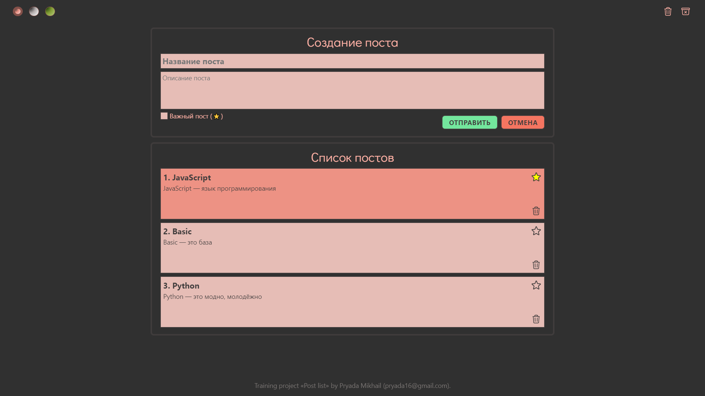

# pet-api-react

## SPA Посты сохраняющиеся в localStorage

### Демо: [https://pryadadev.github.io/pet-api-react](https://pryadadev.github.io/pet-api-react)

### Stack: React, JavaScript, SCSS, Webpack.

### Функционал:
1) При отправке формы данные сначала записываются в `localStorage`
2) Таблица строится при изменении `localStorage`
3) Возможность менять тему: **тёмная**, **светлая**, **зелёная**
4) При первом заходе на сайт **тёмная** или **светлая** тема выбирается в зависимости от темы установленной в устройстве пользователя (например, системная тема Windows)
5) Можно отмечать пост как **важный**
6) Кнопка "Удалить все посты" очищает список постов в `localStorage`
7) Кнопка "Отменить изменения" очищает полностью `localStorage` и возвращает все значения по умолчанию
